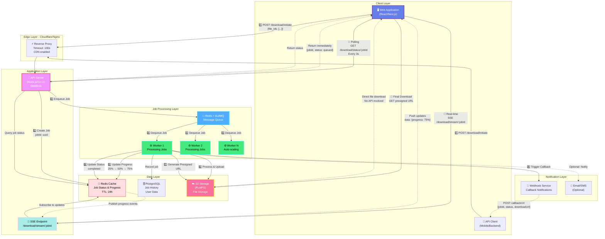
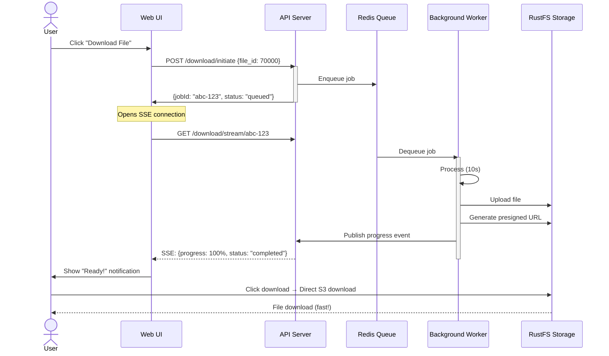
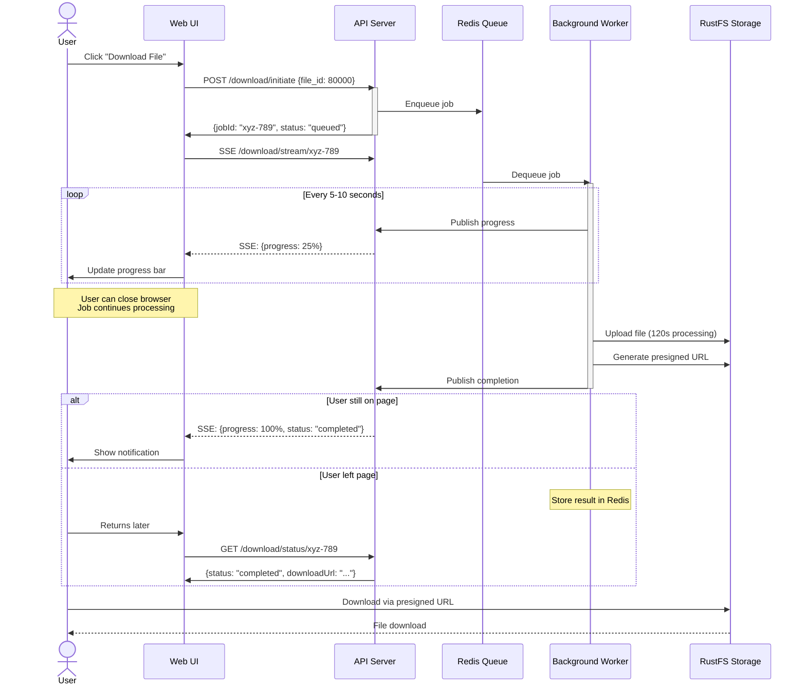
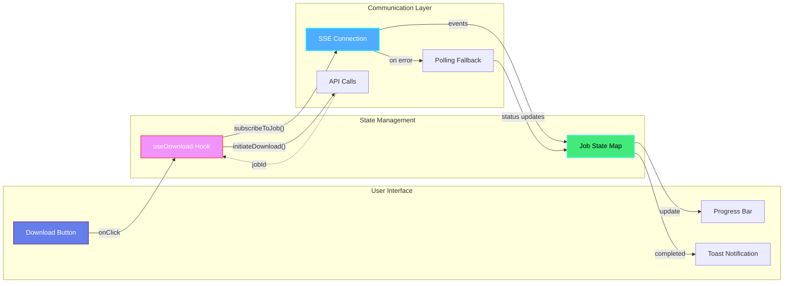

# Challenge 2: Long-Running Download Architecture Design

## 📋 Executive Summary

This document presents a **Hybrid Asynchronous Download Architecture** designed to handle file downloads with highly variable processing times (10-120+ seconds) while providing an excellent user experience and avoiding common pitfalls like proxy timeouts, resource exhaustion, and retry storms.

> **For Non-Technical Readers**: Imagine ordering food at a restaurant. Instead of waiting at the counter while your food is being prepared (which blocks other customers), you get a number, sit down, and the restaurant notifies you when your order is ready. Our architecture works the same way—users don't wait for downloads, they get notified when files are ready.

---

## 🎯 The Problem We're Solving

### Current Challenges

| Challenge | Impact | Real-World Example |
|-----------|--------|-------------------|
| **Connection Timeouts** | Proxies like Cloudflare kill requests after 100 seconds | User requests a 120-second download → timeout error at 100s |
| **Poor User Experience** | No progress feedback during 2+ minute waits | User stares at loading spinner, doesn't know if it's working |
| **Resource Waste** | Open HTTP connections consume server memory | 1000 concurrent 2-minute downloads = server overload |
| **Retry Storms** | Dropped connections trigger automatic retries | Failed request → retry → duplicate processing → wasted resources |

### Business Impact

- ❌ **High bounce rates**: Users abandon slow downloads
- ❌ **Increased costs**: Wasted server resources on duplicate work
- ❌ **Poor reviews**: Frustrated users leave negative feedback
- ❌ **Scalability issues**: System can't handle peak loads

---

## 🏗️ Proposed Architecture: Hybrid Asynchronous Pattern

We recommend a **Hybrid Approach** combining:
- ✅ **Polling** for simple, universal compatibility
- ✅ **Server-Sent Events (SSE)** for real-time progress updates
- ✅ **Webhooks** for server-to-server notifications
- ✅ **Presigned S3 URLs** for efficient, direct downloads

### Why Hybrid?

| Pattern | Pros | Cons | Our Use Case |
|---------|------|------|--------------|
| Polling | Simple, works everywhere | Higher server load | ✅ Fallback for basic clients |
| WebSocket/SSE | Real-time updates | More complex, connection management | ✅ Primary for web UI |
| Webhooks | Server-to-server, reliable | Requires client server | ✅ For API integrations |
| Hybrid | Best of all worlds | More implementation work | ✅ **Our Choice** |

---

## 🎨 System Architecture Diagram



---

## 🌊 Data Flow Visualization

### Fast Downloads (10-15 seconds)



### Slow Downloads (60-120 seconds)



---

## 🔧 Technical Implementation Details

### 1. API Contract Changes

#### ✅ New Endpoints

**Initiate Download (Modified)**
```http
POST /v1/download/initiate
Content-Type: application/json

{
  "file_ids": [70000, 80000, 90000],
  "callback_url": "https://client.com/webhook/download" // Optional
}

Response 202 Accepted:
{
  "job_id": "550e8400-e29b-41d4-a716-446655440000",
  "status": "queued",
  "total_files": 3,
  "estimated_time_seconds": 45,
  "poll_url": "/v1/download/status/550e8400-e29b-41d4-a716-446655440000",
  "stream_url": "/v1/download/stream/550e8400-e29b-41d4-a716-446655440000"
}
```

**Check Job Status (New)**
```http
GET /v1/download/status/:jobId

Response 200 OK:
{
  "job_id": "550e8400-e29b-41d4-a716-446655440000",
  "status": "processing", // queued | processing | completed | failed
  "progress": 65,  // 0-100
  "files_processed": 2,
  "files_total": 3,
  "current_file": {
    "file_id": 80000,
    "status": "processing",
    "progress": 45
  },
  "estimated_completion_seconds": 20,
  "download_url": null,  // Available when status = completed
  "error": null,
  "created_at": "2025-12-12T10:00:00Z",
  "updated_at": "2025-12-12T10:01:30Z"
}
```

**Real-Time Stream (New - Server-Sent Events)**
```http
GET /v1/download/stream/:jobId
Accept: text/event-stream

Response 200 OK (streaming):
Content-Type: text/event-stream

event: progress
data: {"job_id":"550e...", "progress":25, "status":"processing"}

event: progress
data: {"job_id":"550e...", "progress":50, "status":"processing"}

event: completed
data: {"job_id":"550e...", "progress":100, "status":"completed", "download_url":"https://..."}
```

**Cancel Job (New)**
```http
DELETE /v1/download/jobs/:jobId

Response 200 OK:
{
  "job_id": "550e8400-e29b-41d4-a716-446655440000",
  "status": "cancelled",
  "message": "Job cancellation requested"
}
```

---

### 2. Database Schema

#### PostgreSQL Tables

**jobs table** - Persistent job history
```sql
CREATE TABLE download_jobs (
    job_id UUID PRIMARY KEY DEFAULT gen_random_uuid(),
    user_id VARCHAR(255) NOT NULL,
    file_ids INTEGER[] NOT NULL,
    status VARCHAR(50) NOT NULL DEFAULT 'queued',
    progress INTEGER DEFAULT 0,
    callback_url TEXT,
    download_url TEXT,
    error_message TEXT,
    retry_count INTEGER DEFAULT 0,
    created_at TIMESTAMP WITH TIME ZONE DEFAULT NOW(),
    updated_at TIMESTAMP WITH TIME ZONE DEFAULT NOW(),
    completed_at TIMESTAMP WITH TIME ZONE,
    
    INDEX idx_user_id (user_id),
    INDEX idx_status (status),
    INDEX idx_created_at (created_at)
);
```

**job_files table** - Individual file processing status
```sql
CREATE TABLE job_files (
    id SERIAL PRIMARY KEY,
    job_id UUID REFERENCES download_jobs(job_id) ON DELETE CASCADE,
    file_id INTEGER NOT NULL,
    status VARCHAR(50) NOT NULL DEFAULT 'pending',
    s3_key TEXT,
    size_bytes BIGINT,
    processing_time_ms INTEGER,
    error_message TEXT,
    created_at TIMESTAMP WITH TIME ZONE DEFAULT NOW(),
    completed_at TIMESTAMP WITH TIME ZONE,
    
    INDEX idx_job_id (job_id),
    INDEX idx_file_id (file_id)
);
```

#### Redis Cache Structure

**Job Status Cache** (TTL: 24 hours)
```javascript
// Key pattern: job:status:{jobId}
{
  "job_id": "550e8400-e29b-41d4-a716-446655440000",
  "status": "processing",
  "progress": 65,
  "files_processed": 2,
  "files_total": 3,
  "current_file_id": 80000,
  "download_url": null,
  "ttl": 86400  // 24 hours
}
```

**Progress Events** (Pub/Sub for SSE)
```javascript
// Channel: job:events:{jobId}
// Messages pushed to subscribers in real-time
{
  "type": "progress",
  "job_id": "550e8400-e29b-41d4-a716-446655440000",
  "progress": 75,
  "status": "processing",
  "timestamp": "2025-12-12T10:01:45Z"
}
```

---

### 3. Background Job Processing with BullMQ

#### Job Queue Configuration

```typescript
// queue-config.ts
import { Queue, Worker, QueueScheduler } from 'bullmq';
import Redis from 'ioredis';

const connection = new Redis({
  host: process.env.REDIS_HOST,
  port: 6379,
  maxRetriesPerRequest: null,
});

export const downloadQueue = new Queue('downloads', {
  connection,
  defaultJobOptions: {
    attempts: 3,  // Retry up to 3 times
    backoff: {
      type: 'exponential',
      delay: 5000,  // 5s, 25s, 125s
    },
    removeOnComplete: {
      age: 86400,  // Keep completed jobs for 24 hours
      count: 1000, // Keep last 1000 jobs
    },
    removeOnFail: {
      age: 604800,  // Keep failed jobs for 7 days
    },
  },
});

// Worker with concurrency
export const downloadWorker = new Worker(
  'downloads',
  async (job) => {
    const { job_id, file_ids, callback_url } = job.data;
    
    for (let i = 0; i < file_ids.length; i++) {
      const file_id = file_ids[i];
      
      // Update progress
      const progress = Math.floor(((i + 1) / file_ids.length) * 100);
      await job.updateProgress(progress);
      
      // Publish real-time event
      await publishProgress(job_id, progress, 'processing');
      
      // Process file (your actual download logic)
      await processFile(file_id);
    }
    
    // Generate presigned S3 URL
    const downloadUrl = await generatePresignedUrl(job_id);
    
    // Trigger webhook if provided
    if (callback_url) {
      await triggerWebhook(callback_url, { job_id, downloadUrl });
    }
    
    return { downloadUrl };
  },
  {
    connection,
    concurrency: 10,  // Process 10 jobs simultaneously
  }
);
```

#### Scheduling & Priorities

```typescript
// High priority for fast downloads
await downloadQueue.add('fast-download', {
  job_id: '550e...',
  file_ids: [70000],
}, {
  priority: 1,  // Higher priority (lower number = higher priority)
});

// Normal priority for bulk downloads
await downloadQueue.add('bulk-download', {
  job_id: '551e...',
  file_ids: [70000, 80000, 90000],
}, {
  priority: 5,
});
```

---

### 4. Error Handling & Retry Logic

```typescript
// Error handling in worker
downloadWorker.on('failed', async (job, err) => {
  console.error(`Job ${job.id} failed:`, err.message);
  
  // Update job status in database
  await db.query(`
    UPDATE download_jobs 
    SET status = 'failed', 
        error_message = $1,
        retry_count = retry_count + 1
    WHERE job_id = $2
  `, [err.message, job.data.job_id]);
  
  // Publish failure event for SSE
  await publishProgress(job.data.job_id, 0, 'failed', err.message);
  
  // Send webhook notification of failure
  if (job.data.callback_url) {
    await triggerWebhook(job.data.callback_url, {
      job_id: job.data.job_id,
      status: 'failed',
      error: err.message,
    });
  }
});

// Retry logic
downloadWorker.on('error', err => {
  console.error('Worker error:', err);
  // Implement circuit breaker pattern
  // If too many errors, pause queue temporarily
});
```

---

### 5. Timeout Configuration

#### Application Layer (API Server)
```typescript
// Different timeouts for different endpoints
app.use('/v1/download/initiate', timeout(5000));      // 5s - just queue creation
app.use('/v1/download/status', timeout(3000));        // 3s - quick status check
app.use('/v1/download/stream', timeout(300000));      // 5min - SSE connection
```

#### Reverse Proxy (Cloudflare)
```nginx
# Cloudflare Workers / Nginx
location /v1/download/initiate {
    proxy_pass http://api-server;
    proxy_read_timeout 10s;  # Fast endpoint
}

location /v1/download/stream {
    proxy_pass http://api-server;
    proxy_read_timeout 300s;  # SSE needs longer timeout
    proxy_buffering off;      # Disable buffering for streaming
    proxy_cache off;
    
    # SSE-specific headers
    proxy_set_header Connection '';
    proxy_http_version 1.1;
    chunked_transfer_encoding off;
}

location /v1/download/status {
    proxy_pass http://api-server;
    proxy_read_timeout 5s;
    proxy_cache_valid 200 3s;  # Cache status for 3 seconds
}
```

---

## 🌐 Proxy Configuration Examples

### Cloudflare Configuration

```javascript
// cloudflare-worker.js
addEventListener('fetch', event => {
  event.respondWith(handleRequest(event.request));
});

async function handleRequest(request) {
  const url = new URL(request.url);
  
  // SSE endpoint - special handling
  if (url.pathname.includes('/download/stream')) {
    // Disable timeout for SSE
    return fetch(request, {
      cf: {
        cacheEverything: false,
        // Cloudflare Enterprise: custom timeout
        timeout: 300000,  // 5 minutes
      },
    });
  }
  
  // Regular endpoints - standard timeout
  if (url.pathname.includes('/download/')) {
    return fetch(request, {
      cf: {
        cacheTtl: 3,  // Cache status checks for 3s
        cacheEverything: false,
      },
    });
  }
  
  return fetch(request);
}
```

### Nginx Configuration

```nginx
# /etc/nginx/sites-available/download-api

upstream api_backend {
    least_conn;  # Load balancing
    server api-server-1:3000 max_fails=3 fail_timeout=30s;
    server api-server-2:3000 max_fails=3 fail_timeout=30s;
    server api-server-3:3000 max_fails=3 fail_timeout=30s;
}

server {
    listen 80;
    server_name api.yourdomain.com;
    
    # General API endpoints
    location /v1/download/initiate {
        proxy_pass http://api_backend;
        proxy_http_version 1.1;
        proxy_set_header Upgrade $http_upgrade;
        proxy_set_header Connection 'upgrade';
        proxy_set_header Host $host;
        proxy_set_header X-Real-IP $remote_addr;
        proxy_set_header X-Forwarded-For $proxy_add_x_forwarded_for;
        
        proxy_connect_timeout 5s;
        proxy_send_timeout 10s;
        proxy_read_timeout 10s;
    }
    
    # Status endpoint with caching
    location /v1/download/status {
        proxy_pass http://api_backend;
        proxy_cache api_cache;
        proxy_cache_valid 200 3s;
        proxy_cache_key "$request_uri";
        
        proxy_connect_timeout 3s;
        proxy_read_timeout 5s;
        
        add_header X-Cache-Status $upstream_cache_status;
    }
    
    # SSE streaming endpoint
    location /v1/download/stream {
        proxy_pass http://api_backend;
        proxy_http_version 1.1;
        
        # SSE specific
        proxy_set_header Connection '';
        proxy_buffering off;
        proxy_cache off;
        
        # Long timeout for streaming
        proxy_connect_timeout 10s;
        proxy_send_timeout 300s;
        proxy_read_timeout 300s;
        
        # Keep-alive
        tcp_nodelay on;
        keepalive_timeout 300s;
        
        # Compression (optional, be careful with SSE)
        gzip off;
    }
}

# Cache configuration
proxy_cache_path /var/cache/nginx/api 
    levels=1:2 
    keys_zone=api_cache:10m 
    max_size=100m 
    inactive=60m;
```

---

## 💻 Frontend Integration (React/Next.js)

### Custom Hook for Download Management

```typescript
// hooks/useDownload.ts
import { useState, useEffect, useCallback } from 'react';

interface DownloadJob {
  jobId: string;
  status: 'queued' | 'processing' | 'completed' | 'failed';
  progress: number;
  downloadUrl?: string;
  error?: string;
}

export function useDownload() {
  const [jobs, setJobs] = useState<Map<string, DownloadJob>>(new Map());
  
  // Initiate download
  const initiateDownload = useCallback(async (fileIds: number[]) => {
    try {
      const response = await fetch('/v1/download/initiate', {
        method: 'POST',
        headers: { 'Content-Type': 'application/json' },
        body: JSON.stringify({ file_ids: fileIds }),
      });
      
      const data = await response.json();
      const { job_id, status } = data;
      
      // Store job
      setJobs(prev => new Map(prev).set(job_id, {
        jobId: job_id,
        status,
        progress: 0,
      }));
      
      // Start SSE connection for real-time updates
      subscribeToJob(job_id);
      
      return job_id;
    } catch (error) {
      console.error('Failed to initiate download:', error);
      throw error;
    }
  }, []);
  
  // Subscribe to SSE for real-time updates
  const subscribeToJob = useCallback((jobId: string) => {
    const eventSource = new EventSource(`/v1/download/stream/${jobId}`);
    
    eventSource.addEventListener('progress', (event) => {
      const data = JSON.parse(event.data);
      setJobs(prev => {
        const newMap = new Map(prev);
        newMap.set(jobId, {
          ...newMap.get(jobId)!,
          progress: data.progress,
          status: data.status,
        });
        return newMap;
      });
    });
    
    eventSource.addEventListener('completed', (event) => {
      const data = JSON.parse(event.data);
      setJobs(prev => {
        const newMap = new Map(prev);
        newMap.set(jobId, {
          ...newMap.get(jobId)!,
          status: 'completed',
          progress: 100,
          downloadUrl: data.download_url,
        });
        return newMap;
      });
      eventSource.close();
    });
    
    eventSource.addEventListener('error', (event) => {
      console.error('SSE error:', event);
      eventSource.close();
      
      // Fallback to polling
      startPolling(jobId);
    });
    
    // Cleanup on unmount
    return () => eventSource.close();
  }, []);
  
  // Fallback polling mechanism
  const startPolling = useCallback((jobId: string) => {
    const pollInterval = setInterval(async () => {
      try {
        const response = await fetch(`/v1/download/status/${jobId}`);
        const data = await response.json();
        
        setJobs(prev => {
          const newMap = new Map(prev);
          newMap.set(jobId, {
            jobId: data.job_id,
            status: data.status,
            progress: data.progress,
            downloadUrl: data.download_url,
            error: data.error,
          });
          return newMap;
        });
        
        // Stop polling when done
        if (data.status === 'completed' || data.status === 'failed') {
          clearInterval(pollInterval);
        }
      } catch (error) {
        console.error('Polling error:', error);
      }
    }, 3000);  // Poll every 3 seconds
    
    return () => clearInterval(pollInterval);
  }, []);
  
  return { jobs, initiateDownload };
}
```

### React Component Example

```tsx
// components/DownloadButton.tsx
import { useDownload } from '@/hooks/useDownload';
import { useState } from 'react';

export function DownloadButton({ fileId }: { fileId: number }) {
  const { jobs, initiateDownload } = useDownload();
  const [currentJobId, setCurrentJobId] = useState<string | null>(null);
  
  const handleDownload = async () => {
    const jobId = await initiateDownload([fileId]);
    setCurrentJobId(jobId);
  };
  
  const currentJob = currentJobId ? jobs.get(currentJobId) : null;
  
  // Render different states
  if (!currentJob) {
    return (
      <button onClick={handleDownload} className="btn-primary">
        📥 Download File
      </button>
    );
  }
  
  if (currentJob.status === 'queued') {
    return <div className="status-badge">⏳ Queued...</div>;
  }
  
  if (currentJob.status === 'processing') {
    return (
      <div className="progress-container">
        <div className="progress-bar" style={{ width: `${currentJob.progress}%` }}>
          {currentJob.progress}%
        </div>
        <span>Processing... {currentJob.progress}% complete</span>
      </div>
    );
  }
  
  if (currentJob.status === 'completed') {
    return (
      <a href={currentJob.downloadUrl} download className="btn-success">
        ✅ Download Ready - Click Here
      </a>
    );
  }
  
  if (currentJob.status === 'failed') {
    return (
      <div className="error-message">
        ❌ Download failed: {currentJob.error}
        <button onClick={handleDownload} className="btn-retry">
          🔄 Retry
        </button>
      </div>
    );
  }
  
  return null;
}
```

---

## 📊 Component Interaction Diagram



---

## 🎯 Key Benefits of This Architecture

### For Users
- ✅ **Instant Response**: No waiting for downloads to complete
- ✅ **Real-Time Updates**: See progress as files are processed
- ✅ **Resilient**: Can close browser, download continues
- ✅ **Reliable**: Automatic retries on failures
- ✅ **Fast Downloads**: Direct S3 downloads, no API bottleneck

### For Developers
- ✅ **Scalable**: Workers can auto-scale independently
- ✅ **Maintainable**: Clear separation of concerns
- ✅ **Observable**: Full job history and metrics
- ✅ **Flexible**: Multiple notification channels (SSE, polling, webhooks)

### For Business
- ✅ **Cost-Effective**: No wasted resources on open connections
- ✅ **Better UX**: Higher completion rates, happier users
- ✅ **Scalable**: Handle 10x traffic without architectural changes
- ✅ **Reliable**: Proven patterns (BullMQ, Redis, S3)

---

## 🚀 Implementation Roadmap

### Phase 1: Core Infrastructure (Week 1-2)
- [ ] Set up Redis and BullMQ
- [ ] Create database schemas (PostgreSQL)
- [ ] Implement job queue and worker
- [ ] Add basic status endpoints

### Phase 2: Real-Time Features (Week 3)
- [ ] Implement SSE endpoint
- [ ] Add progress tracking
- [ ] Build frontend hooks
- [ ] Test with load

### Phase 3: Resilience & Polish (Week 4)
- [ ] Add retry logic and error handling
- [ ] Implement webhook callbacks
- [ ] Set up monitoring and alerts
- [ ] Performance optimization

### Phase 4: Production Deployment (Week 5)
- [ ] Configure reverse proxy (Cloudflare/Nginx)
- [ ] Load testing
- [ ] Documentation
- [ ] Deploy to production

---

## 📈 Cost Considerations

| Component | Free Tier | Paid (1M downloads/month) | Recommendation |
|-----------|-----------|---------------------------|----------------|
| **Redis** | Redis Cloud (30MB free) | $7-15/month (1GB) | ✅ Start free, scale as needed |
| **PostgreSQL** | Supabase/Neon (500MB free) | $10-20/month (2GB) | ✅ Free tier sufficient initially |
| **BullMQ** | Free (OSS) | Free | ✅ Free forever |
| **S3 (RustFS)** | Self-hosted | $0 (self-hosted) | ✅ Already implemented |
| **Workers** | Same servers as API | $50-100/month (dedicated) | ⚠️ Start shared, scale to dedicated |

**Total Monthly Cost**: $0 (free tier) → $67-135 (production scale)

---

## 🏁 Conclusion

This hybrid architecture provides a robust, scalable solution for handling long-running downloads while maintaining excellent user experience. By decoupling download processing from HTTP connections, we eliminate timeout issues, reduce resource waste, and provide users with real-time feedback.

The architecture is production-ready, cost-effective, and built on proven technologies (Redis, BullMQ, PostgreSQL, S3). It scales horizontally by adding more workers and can handle millions of downloads per month.

**Next Steps**: Review this architecture, discuss any concerns, and proceed with Phase 1 implementation!

---

*For questions or clarification, please refer to the implementation roadmap or consult the technical team.*
