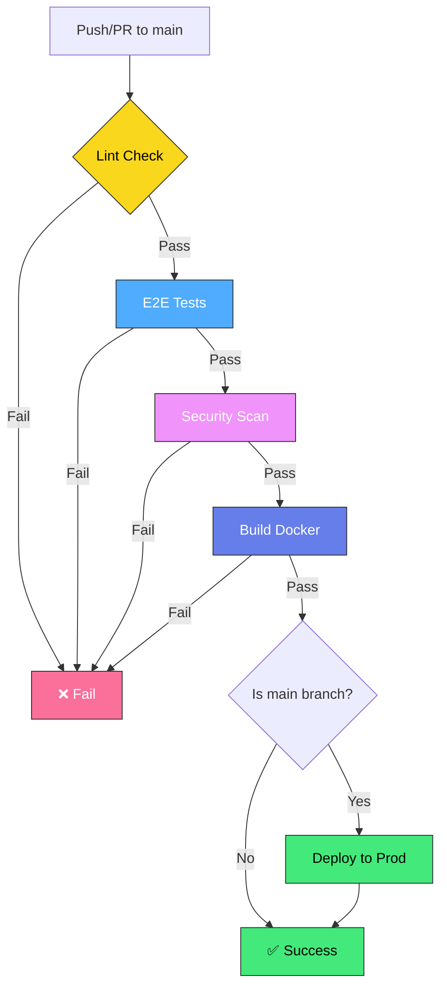

# CI/CD Pipeline Documentation

## Overview

This document provides detailed information about the CI/CD pipeline for the Delineate Hackathon Challenge project.

## Pipeline Architecture



## Stages Explained

### 1. Lint & Format Check (🔍)

**Purpose**: Ensure code quality and consistency

**What it does**:

- Runs ESLint to check for code issues
- Validates code formatting with Prettier
- Caches npm dependencies for faster runs

**Commands executed**:

```bash
npm run lint
npm run format:check
```

**Fails if**:

- ESLint finds errors
- Code is not properly formatted

**Fix locally**:

```bash
npm run lint:fix
npm run format
```

---

### 2. E2E Tests (🧪)

**Purpose**: Validate all functionality works correctly

**What it does**:

- Runs the complete end-to-end test suite
- Tests all API endpoints
- Validates request/response formats
- Checks security headers, rate limiting, etc.

**Commands executed**:

```bash
npm run test:e2e
```

**Test coverage**:

- 29 test cases covering:
  - Root endpoint
  - Health checks with storage
  - Security headers
  - Download endpoints
  - Request ID tracking
  - Content-Type validation
  - Rate limiting

**Fails if**:

- Any test case fails
- API doesn't respond correctly
- Storage integration issues

---

### 3. Security Scanning (🔒)

**Purpose**: Identify security vulnerabilities early

**What it does**:

- **Trivy Scan**: Checks for vulnerabilities in dependencies and code
  - Scans package.json dependencies
  - Checks for known CVEs
  - Reports CRITICAL and HIGH severity issues
- **CodeQL Analysis**: Static code analysis for security issues
  - Detects SQL injection risks
  - Identifies XSS vulnerabilities
  - Finds other security anti-patterns

**Results location**:

- GitHub Security tab
- SARIF reports uploaded automatically

**Fails if**:

- Critical vulnerabilities found
- High-severity security issues detected

---

### 4. Build Docker Images (🐳)

**Purpose**: Create deployable artifacts

**What it does**:

- Builds Docker images for both dev and prod
- Pushes to GitHub Container Registry (GHCR)
- Uses layer caching for speed
- Tags images appropriately:
  - `dev-latest` - Latest dev build
  - `dev-{sha}` - Specific commit
  - `latest` - Latest main branch (prod)
  - `{sha}` - Specific commit (prod)

**Images built**:

1. Development image (`Dockerfile.dev`)
2. Production image (`Dockerfile.prod`)

**Registry**: `ghcr.io/{username}/cuet-micro-ops-hackthon-2025`

**Fails if**:

- Docker build errors
- Missing dependencies
- Invalid Dockerfile syntax

---

### 5. Deploy (🚀) - Optional

**Purpose**: Automatically deploy to production

**What it does**:

- Only runs on push to `main` branch
- Deploys to configured platform
- Updates production environment

**Supported platforms**:

- Railway
- Render
- Fly.io
- Heroku
- Digital Ocean App Platform

**Configuration needed**:

1. Set platform-specific secrets in GitHub
2. Uncomment deployment step in workflow
3. Configure platform CLI or API

---

## Caching Strategy

### npm Dependencies Cache

```yaml
- uses: actions/cache@v4
  with:
    path: ~/.npm
    key: ${{ runner.os }}-node-${{ hashFiles('**/package-lock.json') }}
```

**Benefits**:

- 50-70% faster dependency installation
- Reduced npm registry load
- Consistent builds

### Docker Layer Cache

```yaml
cache-from: type=gha
cache-to: type=gha,mode=max
```

**Benefits**:

- 60-80% faster Docker builds
- Only rebuilds changed layers
- Shared across workflow runs

---

## Performance Metrics

Typical run times (with caching):

| Stage     | Duration    | Notes                      |
| --------- | ----------- | -------------------------- |
| Lint      | ~30s        | Fast, mostly I/O bound     |
| Test      | ~45s        | Depends on test complexity |
| Security  | ~2-3min     | Trivy + CodeQL analysis    |
| Build     | ~1-2min     | Docker layer caching helps |
| **Total** | **~5-7min** | Full pipeline              |

Without caching: ~15-20 minutes

---

## Troubleshooting

### Lint Failures

**Error**: `ESLint found errors`

**Solution**:

```bash
# See what's wrong
npm run lint

# Auto-fix most issues
npm run lint:fix

# Check the diff
git diff
```

### Test Failures

**Error**: `E2E tests failed`

**Solution**:

```bash
# Run tests locally
npm run test:e2e

# Check logs for specific failure
# Fix the failing test or code
# Re-run to verify
```

### Security Vulnerabilities

**Error**: `Trivy found vulnerabilities`

**Solution**:

```bash
# Update dependencies
npm audit fix

# For manual fixes
npm audit

# Upgrade specific package
npm install package@latest
```

### Docker Build Failures

**Error**: `Docker build failed`

**Solution**:

```bash
# Build locally to test
docker build -f docker/Dockerfile.prod .

# Check Dockerfile syntax
# Verify all COPY paths exist
# Ensure dependencies in package.json
```

---

## Manual Workflow Trigger

You can manually trigger the pipeline:

1. Go to GitHub Actions tab
2. Select "CI/CD Pipeline"
3. Click "Run workflow"
4. Choose branch
5. Click "Run workflow" button

---

## Secrets Configuration

For deployment and notifications, configure these secrets:

1. Go to repository Settings
2. Navigate to Secrets and Variables → Actions
3. Add the following secrets:

| Secret Name         | Purpose               | Example                                |
| ------------------- | --------------------- | -------------------------------------- |
| `RAILWAY_TOKEN`     | Railway deployment    | `railway-token-xxx`                    |
| `SLACK_WEBHOOK_URL` | Slack notifications   | `https://hooks.slack.com/...`          |
| `DISCORD_WEBHOOK`   | Discord notifications | `https://discord.com/api/webhooks/...` |

---

## Branch Protection Rules

Recommended settings for `main` branch:

1. Go to Settings → Branches
2. Add rule for `main`
3. Enable:
   - ✅ Require status checks to pass before merging
   - ✅ Require branches to be up to date before merging
   - ✅ Required checks:
     - `lint`
     - `test`
     - `security`
     - `build`
   - ✅ Require pull request reviews (1+)
   - ✅ Dismiss stale reviews
   - ✅ Require linear history
   - ✅ Include administrators

---

## Extending the Pipeline

### Adding Slack Notifications

1. Create Slack incoming webhook
2. Add `SLACK_WEBHOOK_URL` secret
3. Uncomment notification step in `.github/workflows/ci.yml`

### Adding Deployment

**For Railway**:

```yaml
- name: Deploy to Railway
  uses: railway/cli@v1
  with:
    service: your-service-name
  env:
    RAILWAY_TOKEN: ${{ secrets.RAILWAY_TOKEN }}
```

**For Render**:

```yaml
- name: Deploy to Render
  run: |
    curl -X POST ${{ secrets.RENDER_DEPLOY_HOOK }}
```

### Adding More Tests

1. Create test file in `scripts/`
2. Add npm script in `package.json`
3. Add step to workflow:

```yaml
- name: Run new tests
  run: npm run test:your-new-test
```

---

## Cost Considerations

GitHub Actions pricing:

- **Free tier**: 2,000 minutes/month for public repos
- **Free tier**: 500 minutes/month for private repos
- **Paid**: $0.008 per minute after free tier

Typical usage:

- ~7 minutes per run
- ~100 runs per month
- **Total**: ~700 minutes/month (within free tier)

---

## Best Practices

1. **Keep workflows fast**:
   - Use caching aggressively
   - Run tests in parallel when possible
   - Skip unnecessary steps

2. **Fail fast**:
   - Run cheap checks first (lint)
   - Stop pipeline on first failure
   - Provide clear error messages

3. **Security**:
   - Never commit secrets to code
   - Use GitHub Secrets for sensitive data
   - Scan regularly with Trivy/CodeQL

4. **Monitoring**:
   - Check GitHub Actions tab regularly
   - Set up notifications for failures
   - Review security scan results

---

## Additional Resources

- [GitHub Actions Documentation](https://docs.github.com/en/actions)
- [Docker Build Push Action](https://github.com/docker/build-push-action)
- [Trivy Scanner](https://github.com/aquasecurity/trivy)
- [CodeQL](https://codeql.github.com/)

---

_Last updated: 2025-12-12_
